# Air pollution prediction using Recurrent Neural Networks (with an Attention mechanism)

Air pollution levels in North Macedonia are 20 times over the limit imposed by the EU. As a result, it is estimated that it contributes for premature deaths in Skopje, Tetovo and Bitola. Moreover, in a recent study researchers from Harvard showed that an increase of only 1 μg/m3 of PM2.5 is associated with an 8% increase in the COVID-19 death rate (95% confidence interval) [*Exposure to air pollution and COVID-19 mortality in the United States. Xiao Wu, Rachel C. Nethery, Benjamin M. Sabath, Danielle Braun, Francesca Dominici*]. The ability to predict the air pollution levels would prove to be of significant help in improving this unwanted statistic. The idea is to examine the trends in historical data generated by the 5 government air pollution sensors in Skopje, with the hope of gaining a better understanding of the situation we are currently in. In this research project we compared the performances of two Recurrent Neural Network (RNN) architectures: standard seq2seq models and seq2seq models with an attention mechanism. The models with an attention mechanism proved to be superior by outperforming their competitor on all metrics in every dataset.

## 1. Attention
In this section we briefly discuss the advantages of the attention mechanism and refer the readers to [*Bahdanau et al. “Neural Machine Translation by Jointly Learning to Align and Translate.”*] for further details.    
Standard encoder-decoder RNN models work in such a way that the encoder processes the input sequence, produces a thought encapsulating the necessary information from the input and passing it to the decoder, which in turn decodes the output sequence. A potential issue with this approach is that the model is forced to compress all the necessary information into a fixed-length vector, which may be difficult to achieve when dealing with long sequences.  
In order to address this issue, the authors introduce an extension to the encoder-decoder model which learns to align and decode jointly. Each time the proposed model decodes an element of the output sequence, it searches for a set of positions in the input sequence where the most relevant information is concentrated. The model then predicts a target vector based on the context vectors associated with these source positions and all the previously generated elements.
The most important distinguishing feature of this approach from the standard encoder-decoder is that it does not attempt to encode the whole input sequence into a single fixed-length vector. Instead, it encodes the input sequence into a sequence of vectors and chooses a subset of these vectors adaptively while decoding the output sequence. This frees the model from having to squash all the information into a single fixed-length vector. 

  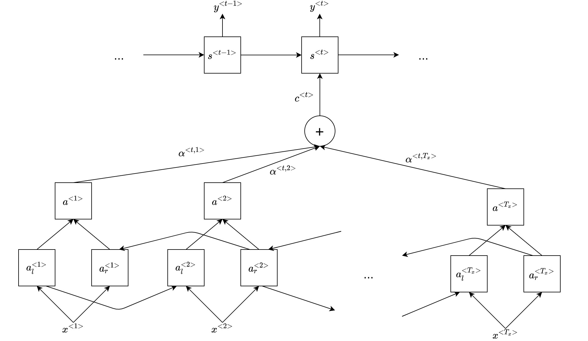
  Figure 1. Attention mechanism

## 2. Related work
In this section we briefly summarize related work in forecasting air pollution. In [*Buiet al. (2018). A Deep Learning Approach for Forecasting Air Pollution in South Korea Using LSTM*] the authors use standard LSTM seq2seq models to forecast air pollutants; In [*Fei et al. (2019). A Model-driven and Data-driven Fusion Framework for Accurate Air Quality Prediction*] the authors use an LSTM model as a corrector for predictions made by the standard CMAQ method; In [*Divyam et al. (2019). VayuAnukulani: Adaptive Memory Networks for Air Pollution Forecasting*] the authors use seq2seq models with an attention mechanism, but without teacher forcing or decoder input; In [*Grégoire et al. (2020). DeepPlume: Very High Resolution Real-Time Air Quality Mapping*] the authors discuss a system for air pollution prediction on a large scale. Regarding research outside the domain, [*Sangyeon et al. (2019). Financial series prediction using Attention LSTM*] and [*Qiu J et al. (2020) Forecasting stock prices with long-short term memory neural networks based on attention mechanism*] demonstrate the superiority of attentive seq2seq models in the field of finance, while [*Gangjun et al. (2019). Research on Short-Term Load Prediction Based on Seq2seq Model*] in the field of electricity load prediction; The authors in [*Fazil et al. “Deep Learning for Renewable Power Forecasting: An Approach Using LSTM Neural Networks.”*] experiment with standard seq2seq models for renewable power forecasting.

## 3. Datasets
In total, three datasets were used for the task of air pollution prediction:
1. Air pollution data generated by 5 government sensors owned by the Ministry of Environment and Physical Planning of North Macedonia (https://www.moepp.gov.mk/), placed in several locations in Skopje: Centar, Karpos, Lisice, Rektorat and Miladinovci. Each of the sensors measures a different subset of pollutants, with PM10 being measured by all of them, hence why we chose this pollutant as the target feature we are predicting. 
2. Weather data fetched from Dark Sky (https://darksky.net/) for each of the sensor locations
3. Generated datetime features (hour of day, day of week, month of year, weekend flag, holiday flag). 

Each of the datasets were on an hourly basis, with Timestamp being the index column. 

## 4. Data analysis  
In this and the following section we will only explore the dataset for Centar in order to keep the documentation brief. However, the same exploratory analysis was performed on all other datasets.  
From Figure 2 we can easily notice the seasonality of the pollution levels.  

  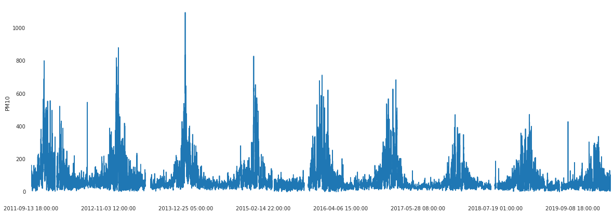
  Figure 2. PM10 measurements

Upon observing Figure 3, we can confirm that the air pollution is highest during the winter months and progressively decreases as summer months approach.  

  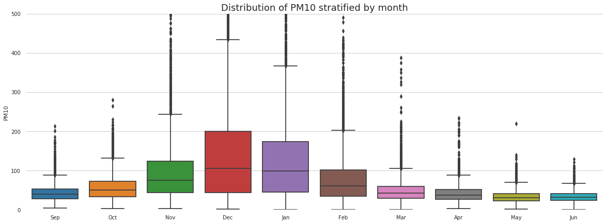
  Figure 3. PM10 measurements stratified by month

From Figure 4 we notice that when we first stratify the data by season of year, then by day of week, the marginal difference of the pollution between the days is higher during the winter period than it is during the summer.  

  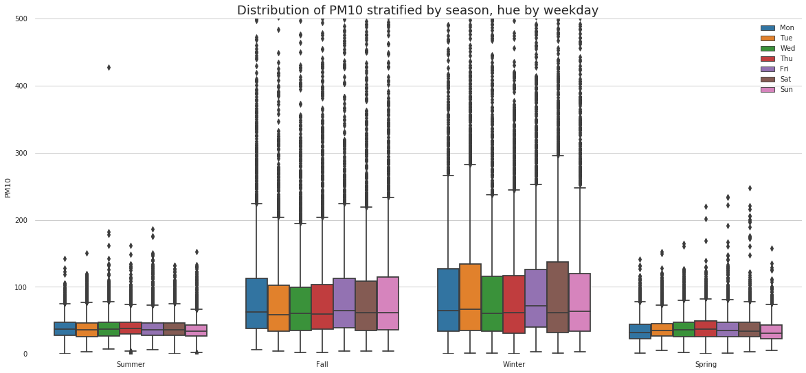
  Figure 4. PM10 measurements stratified by season, hue by weekday

Last but not least, from Figure 5 we notice that the marginal difference of pollution between the periods of the day is most notable during the winter months, with the periods between 9pm and 3am being the most polluted.

  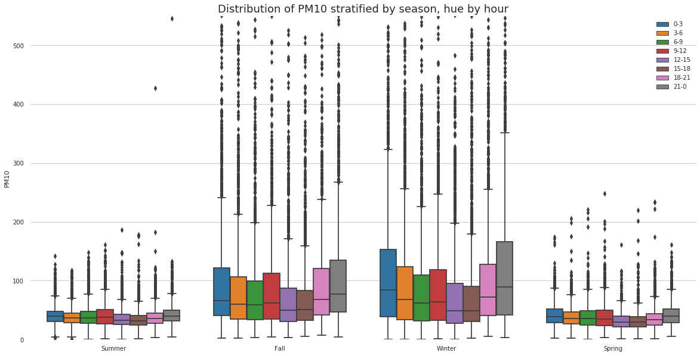
  Figure 5. PM10 measurements stratified by season, hue by period of day

## 5. Data preprocessing
### 5.1. Air pollution datasets
As we mentioned earlier, each sensor measures only a subset of the pollutants. Upon observing the plot for missing values for the air pollution dataset (Figure 6), we decided to discard all of the pollutants except with PM10 and with PM2.5. Furthermore, the dataset was truncated and we only used measurements from 2011 onward. 

  
  Figure 6. Missing values for the pollutants

Now, from the histogram of sensor inoperability duration (Figure 7), we notice that the periods of inoperability are usually short and last only a few hours. 

  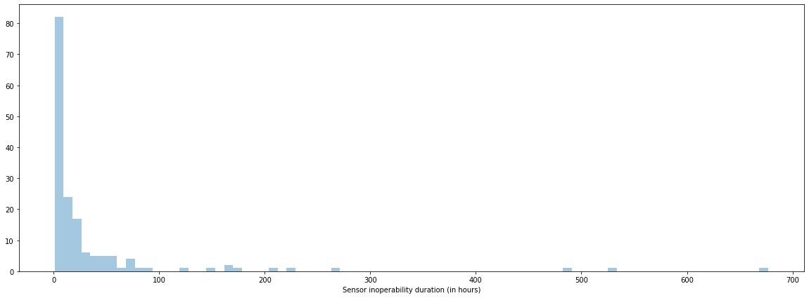
  Figure 7. Sensor inoperability

Naturally, PM measurements have exponential distribution (Figure 8, left) and have a few outliers. Usually, machine learning algorithms converge faster when the data is scaled. If we decide to normalize this feature in a certain range, due to its distribution and outliers, the values will generally fall in the lower end of the range. On the other hand, if we want to standardize the feature, it needs to have Gaussian distribution beforehand. If we log-transform the feature, not only do we transform its distribution to Gaussian (Figure 8, right), but we suppress the outliers as well, solving both problems at once. This transformation is performed on both PM10 and PM2.5 and then, standardize these features with mean 0 and std 1. Similar transformations were performed on the other air pollution datasets.

  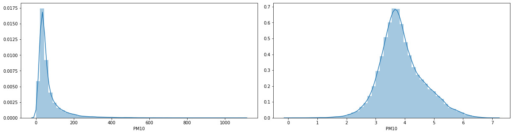
  Figure 8. Distribution of PM10 (left) and log-transformed PM10 (right)

  

### 5.2. Weather datasets  
Upon observing the plot for missing values for the weather datasets (Figure 9), we decided to discard the following features: icon, precipAccumulation, precipAccumulation.1, precipType, ozone, pressure, summary and windGust. Accordingly, we used the following weather features: temperature, apparentTemperature , cloudCover, dewPoint, humidity, precipIntensity, precipProbability, uvIndex, visibility, windBearing and windSpeed.   

  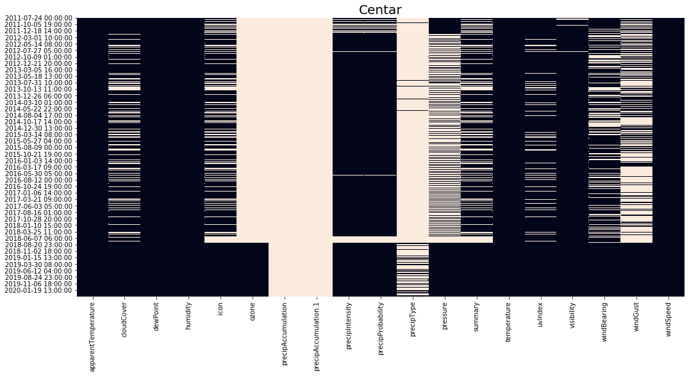
  Figure 9. Missing values for the weather features

Due to the cyclical nature of the wind bearing feature, it was projected into two separate ones with the sin/cos transformation in order to capture the spatial proximity. The temperature, humidity and dewpoint naturally have Gaussian distribution, so these features were standardized with mean 0 and std 1, while the others were normalized in the range [0, 1].   

### 5.3. Datetime datasets
This dataset doesn't have missing values since it is generated. As before, due to the cyclical nature of the hour, day and month features, they were projected into two separate ones with the sin/cos transformation in order to capture the temporal proximity. Furthermore, each of these features were normalized in the range [0, 1].  

### 5.4. Miscellaneous  
From the correlation matrix (Figure 10), we notice that only temperature and apparent temperature have high correlation coefficient. In order to avoid redundant features in our datasets, we discard apparent temperature.   

  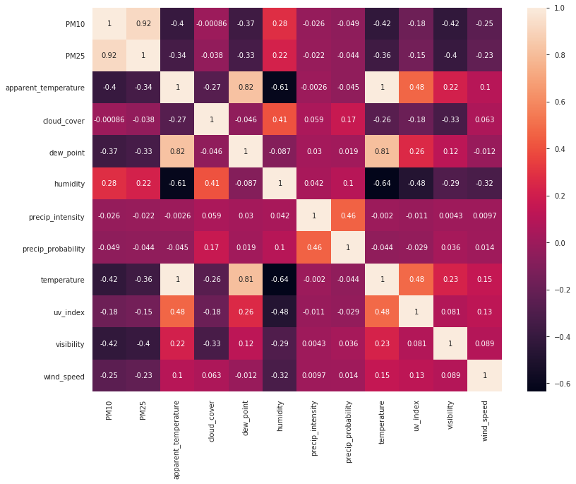 
  Figure 10. Correlation matrix of the numerical features

The train/val/test split ratio was 90%, 5%, 5%. In order to avoid look-ahead bias, the partitions are consecutive (Table 1).  
<table>
    <thead>
        <tr>
            <th rowspan=2>Location</th>
            <th colspan=2>Train set</th>
            <th colspan=2>Validation set</th>
            <th colspan=2>Test set</th>
        </tr>
        <tr>
              <th>from</th>
              <th>to</th>
              <th>from</th>
              <th>to</th>
              <th>from</th>
              <th>to</th>
          </tr>
    </thead>
    <tbody>
        <tr>
            <td>Centar</td>
            <td>13.09.2011</td>
            <td>24.05.2019</td>
            <td>24.05.2019</td>
            <td>27.10.2019</td>
            <td>27.10.2019</td>
            <td>31.03.2020</td>
        </tr>
        <tr>
            <td>Karpos</td>
            <td>14.09.2011</td>
            <td>24.05.2019</td>
            <td>24.05.2019</td>
            <td>27.10.2019</td>
            <td>27.10.2019</td>
            <td>31.03.2020</td>
        </tr>
        <tr>
            <td>Lisice</td>
            <td>17.12.2012</td>
            <td>06.03.2018</td>
            <td>06.03.2018</td>
            <td>19.06.2018</td>
            <td>19.06.2018</td>
            <td>03.10.2018</td>
        </tr>
        <tr>
            <td>Rektorat</td>
            <td>30.07.2014</td>
            <td>06.09.2019</td>
            <td>06.09.2019</td>
            <td>19.12.2019</td>
            <td>19.12.2019</td>
            <td>31.03.2020</td>
        </tr>
        <tr>
            <td>Miladinovci</td>
            <td>14.04.2016</td>
            <td>08.11.2019</td>
            <td>08.11.2019</td>
            <td>19.01.2020</td>
            <td>19.01.2020</td>
            <td>31.03.2020</td>
        </tr>
    </tbody>
</table>

  Table 1. Dataset partitions

Even though we tried our best to discard the features and periods with a lot of missing values, we still have missingness in our data. In order to cope with this problem, several imputation techniques were utilized. The process of evaluating the imputers was as following:
1. We fit each imputer on the train set.
2. We generate probability mass function for each feature to have a missing value, based on the data of the train set.
3. We discard the rows of the validation set with missing values.
4. We iterate the set generated in step 3 and purposefully discard some of the values, with probabilities defined in step 2 (the discarding is not performed in place - we create a copy of the dataset and make the discards there). In this moment, we have two matrices: one with missing values (step 4) and an another with the true values (step 3)
5. Using the fitted imputers (step 1) we fill in the missing values from the matrix in step 4.
6. We calculate the distance between the imputed matrix (step 5) and the matrix with true values (step 3) using Frobenius norm.   

The results are summarized in Table 2. Note: it was impossible to fit certain imputers due to RAM shortage.  
<table>
    <thead>
        <tr>
            <th rowspan=2>Imputer</th>
            <th colspan=5>Location</th>
        </tr>
        <tr>
              <th>Centar</th>
              <th>Karpos</th>
              <th>Lisice</th>
              <th>Rektorat</th>
              <th>Miladinovci</th>
          </tr>
    </thead>
    <tbody>
        <tr>
            <td>Mean</td>
            <td>8.503</td>
            <td>10.361</td>
            <td>5.539</td>
            <td>9.027</td>
            <td>12.127</td>
        </tr>
        <tr>
            <td>Median</td>
            <td>8.636</td>
            <td>10.330</td>
            <td>5.187</td>
            <td>9.129</td>
            <td>12.805</td>
        </tr>
        <tr>
            <td>Bayesian ridge</td>
            <td>7.324</td>
            <td>8.040</td>
            <td>4.299</td>
            <td>7.591</td>
            <td>8.412</td>
        </tr>
        <tr>
            <td>Decision tree</td>
            <td>8.699</td>
            <td>10.796</td>
            <td>6.030</td>
            <td>9.506</td>
            <td>10.914</td>
        </tr>
        <tr>
            <td>K-neighbors (15)</td>
            <td>6.815</td>
            <td>8.616</td>
            <td>4.462</td>
            <td>8.128</td>
            <td>8.313</td>
        </tr>
        <tr>
            <td>K-neighbors (20)</td>
            <td>6.778</td>
            <td>8.454</td>
            <td>4.287</td>
            <td>7.992</td>
            <td>8.225</td>
        </tr>
        <tr>
            <td>Extra trees (10)</td>
            <td>6.331</td>
            <td>8.082</td>
            <td>4.299</td>
            <td>6.969</td>
            <td>7.713</td>
        </tr>
        <tr>
            <td>Extra trees (15)</td>
            <td>5.965</td>
            <td>8.024</td>
            <td>4.141</td>
            <td><b>6.821</b></td>
            <td>7.870</td>
        </tr>
        <tr>
            <td>Extra trees (20)</td>
            <td><b>5.755</b></td>
            <td><b>7.522</b></td>
            <td><b>4.017</b></td>
            <td>6.857</td>
            <td>7.827</td>
        </tr>
        <tr>
            <td>Extra trees (25)</td>
            <td>6.011</td>
            <td>infeasible</td>
            <td>4.034</td>
            <td>7.039</td>
            <td>7.835</td>
        </tr>
        <tr>
            <td>Extra trees (30)</td>
            <td>5.913</td>
            <td>infeasible</td>
            <td>infeasible</td>
            <td>infeasible</td>
            <td><b>7.800</b></td>
        </tr>
    </tbody>
</table>

  Table 2. Imputer performances

The missing values for each dataset were filled with the accordingly best performing imputer. Before filling in the values, for each of the pollutant we added an additional feature indicating whether or not the value was imputed.  

Finally, we are ready to construct the datasets in a format that is appropriate for the seq2seq models. Each dataset is further split into:
* Encoder input data - a tensor of shape (num_samples, Tx, num_encoder_features), where Tx is the input sequence length. Air pollution, weather and datetime features are passed as input for the encoder. These features correspond to the historic timesteps.
* Decoder input data - a tensor of shape (num_samples, Ty, num_decoder_features), where Ty is the output sequence length. Date time features, PM10 predictions in the previous step, and the context vector (in case of an attentive architecture) are passed as input for the decoder. These features correspond to the future timesteps. Note: we can generate the datetime features for the future timesteps beforehand since they are deterministic, hence why we can use them as input for the decoder without suffering a data leak. 
* Decoder target data - a tensor of shape (num_samples, Ty, 1) since we are predicting PM10 only. Note: we discard all samples which have at least one imputed PM10 value in the target vector. 

## 6. Modeling
As we mentioned before, we are going to compare the performances of a standard versus an attentive seq2seq model. At this point it is fair to note that the input sequences are 24 hours long and we are trying to forecast the next 12 hours of PM10 pollution (output sequence length). We use the following notation for model description:
* x&lt;t&gt; - vector consisting of air pollution, weather and datetime features at time t. This is an input for the encoder LSTM cells.
* z&lt;t&gt; - vector consisting of datetime features only at time t. This vector concatenated with the PM10 predictions in the previous step, y&lt;t-1&gt;, and the calculated context vector c&lt;t&gt; (in case of an attentive architecture) is used as an input for the decoder LSTM cells. 
* y&lt;t&gt; - output vector at time t.

Both models (Fig 11 and 12) are implemented in Tensorflow 2.1.0 through the Keras API. We used MSE as the loss function along with the Adam optimizer. 

  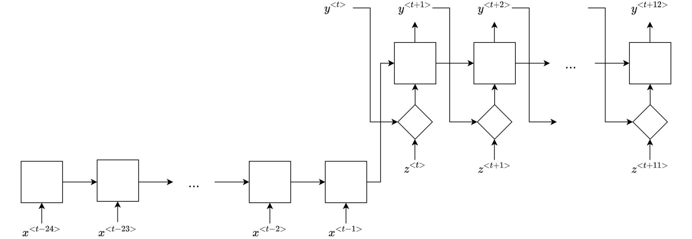
  Figure 11. Standard architecture

The models were trained on several GPUs offered by Google Colab. As to save time on unnecessarily training unsuccessful models, we used the Early Stopping criteria with the patience parameter varying between 10 and 15.   

  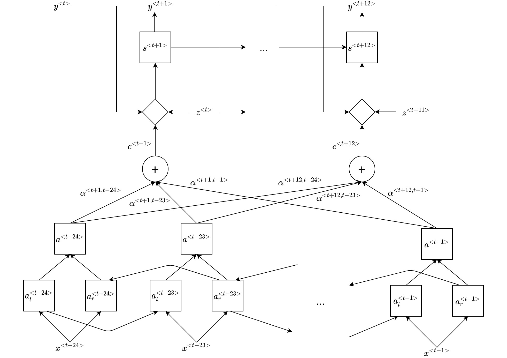
  Figure 12. Attentive architecture

  

In order to find the best hyperparameters for both architectures, a random search was performed. The hyperparameter ranges were based on [<em>Klaus et al. (2015). LSTM: A search space odyssey</em>] and empirical research. Moreover, the ranges were constantly updated based on the top 10 performing models for each architecture in order to narrow down the search space. 

## 7. Results  
The best models from the two architectures were evaluated on the test sets using the following metrics: RMSE and R2. RMSE is a metric that indicates how much the predictions differ from the true values. On the other hand R2 indicates what proportion of the variance of the dependent variable is predicted by the model. A model that predicts the mean only (without taking into account the inputs) will have R2=0, while a model that perfectly predicts the target values will have R2=1. When using non-linear models, it is also possible that R2&lt;0. In this case, predicting the mean will yield better results.  

From the results in Table 3, we can notice that the attentive architecture consistently outperforms the standard one. However, when comparing the architectures, we should take into consideration the metric we are observing. For illustration, upon observing the results for the test set of Miladinovci, we notice that the improvement in the RMSE score goes from 40.641 to 32.906 (nearly 8 points). This difference may not seem very significant, but if we notice the improvement in the R2 score (from 0.239 to 0.501), we see that there is a significant improvement of 25% in the explained variance of the variable we are predicting. This is true for all other datasets, except for Lisice.  

<table>
    <thead>
        <tr>
            <th rowspan=2>Location</th>
            <th colspan=3>RMSE</th>
            <th colspan=2>R2</th>
        </tr>
        <tr>
              <th>mean</th>
              <th>standard</th>
              <th>attentive</th>
              <th>standard</th>
              <th>attentive</th>
          </tr>
    </thead>
    <tbody>
        <tr>
            <td>Centar</td>
            <td>47.280</td>
            <td>36.494</td>
            <td><b>33.454</b></td>
            <td>0.404</td>
            <td><b>0.499</b></td>
        </tr>
        <tr>
            <td>Karpos</td>
            <td>50.214</td>
            <td>41.193</td>
            <td><b>34.660</b></td>
            <td>0.327</td>
            <td><b>0.524</b></td>
        </tr>
        <tr>
            <td>Lisice</td>
            <td>22.399</td>
            <td>23.732</td>
            <td><b>21.918</b></td>
            <td>-0.123</td>
            <td><b>0.042</b></td>
        </tr>
        <tr>
            <td>Rektorat</td>
            <td>73.772</td>
            <td>68.508</td>
            <td><b>54.061</b></td>
            <td>0.138</td>
            <td><b>0.463</b></td>
        </tr>
        <tr>
            <td>Miladinovci</td>
            <td>46.574</td>
            <td>40.641</td>
            <td><b>32.906</b></td>
            <td>0.239</td>
            <td><b>0.501</b></td>
        </tr>
    </tbody>
</table>

  Table 3. Results

First of all, the reason why we have such a low RMSE score for the test set of Lisice is because it largely contains the summer period (from 19.06.2018 till 03.10.2018, Table 1), period when the air pollution is lowest (Figure 3). Furthermore, we notice that the dummy model that predicts the mean only is almost as good as the trained models - again, this is as a result of the smaller variance in the pollution during the summer period (Lisice, Figure 13), hence why the mean is a good estimator.  

  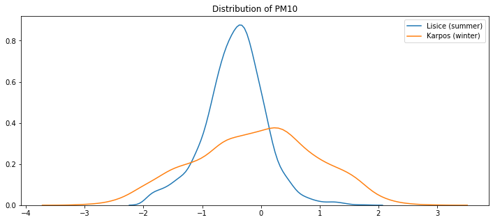 
  Figure 13. Distribution of PM10 in the test sets of Lisice (summer) and Karpos (winter)

Naturally, we notice that predicting the mean for the other test sets (which largely contain the winter period) give significantly worse results (ex. Karpos, RMSE=50.214 for the dummy model vs RMSE=34.660 for the attentive model) since the variance is larger (Karpos, Figure 13).

## 8. Future work
Lastly, we propose several ideas for future work which could potentially improve the model performances:
1. Predicting all of the available pollutants for each dataset. By propagating the predictions for the other datasets as an input for the decoder, the model could perform better since the air pollution features are highly correlated between themselves.
2. Adding weather forecast to the decoder input. Due to the relationship between the air pollution and the weather, the model performance could be significantly boosted if it has an estimate of the weather condition for the future timesteps. 
3. Utilizing GRU instead of LSTM cells. These cells have significantly simpler architecture which could lead to models that generalize better. 

We have started working on implementing proposals 1 and 2 in an automated manner. The files are located in the "automation" directory in this repo. 

## Conclusion
The World Health Organization indicates air pollution as a hazardous byproduct of human activity, causing serious health problems, accounting for over 4.2 million premature deaths worldwide [*World Health Organization. (2018). Air pollution and child health: prescribing clean air: summary. World Health Organization*]. Having this in mind, we turn to forecasting the air pollution level with the goal of contributing to the research and projects developing tools that people use in order to limit their outdoor exposure to these harmful particles. We compared the performances of two seq2seq architectures and demonstrated the superiority of the attentive models on datasets stemming from 5 air pollution sensors in Skopje, North Macedonia. Despite the increasing interest in research on this topic, a true change will not occur when an extremely accurate forecasting model is made, but when the institutions in power, in collaboration with the citizens, will take the appropriate measures to reduce the pollution.

